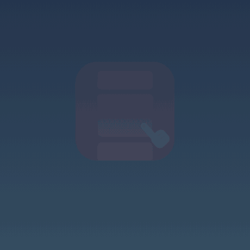

# Scrollbrella

**An umbrella against doom-scrolling.** Scrollbrella is a tiny home-screen app you open *instead of* YouTube Shorts or social feeds: a calm background, a gentle prompt, and quiet piano. A moment of rest rather than another scroll.

- Calm prompts you write yourself, plus time-of-day ones (morning plans, evening reflection)
- Soft piano (Satie, public domain) with one tap
- Works offline, no account, no tracking; everything stays on your device
- Optional sync between devices through a secret Gist on your own GitHub account

**Open it:** https://fulaibaowang.github.io/scrollbrella/

## Add to your iPhone home screen

1. Open the link above in **Safari**.
2. Tap **Share → Add to Home Screen → Add**.
3. Launch it from the red umbrella icon; it opens full-screen like an app.

Tap the screen for the next prompt, the ✎ (bottom right) to edit prompts, and ♪ (bottom left) to toggle music.

## Open it automatically when you reach for a feed

With the iPhone **Shortcuts** app you can have Scrollbrella pop up whenever you open a distracting app:

1. Open **Shortcuts → Automation → +** (New Automation).
2. Choose **App**, select the apps (e.g. YouTube, Instagram, TikTok), and tick **Is Opened**.
3. Choose **Run Immediately** (and turn off **Notify When Run** if you prefer), then **Next**.
4. Tap **New Blank Automation → Add Action**, search for **Open URLs**, and enter
   `https://fulaibaowang.github.io/scrollbrella/`.
5. Tap **Done**.

Now opening one of those apps sends you to Scrollbrella first. iOS opens the link in Safari rather than the home-screen app, and Safari keeps its own copy of your prompts, so edit them in whichever one you use most.

## Credits

Music: *Gymnopédie No. 1* by Erik Satie, performed by Robin Alciatore. Public domain, courtesy of [Musopen](https://musopen.org/), via [Wikimedia Commons](https://commons.wikimedia.org/wiki/File:Erik_Satie_-_gymnopedies_-_la_1_ere._lent_et_douloureux.ogg).

Contributing or working on the code? See [AGENTS.md](AGENTS.md).
